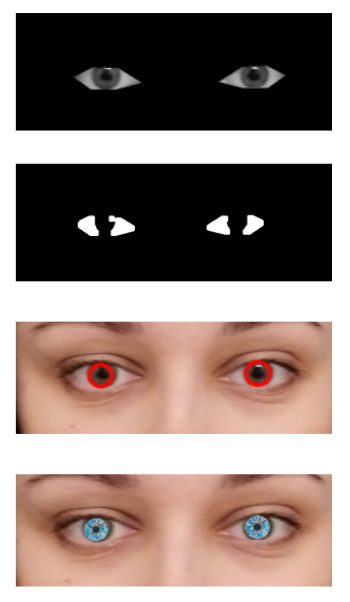

# Face-masking-with-CV
Final Project on Computer Vision Skoltech course 2020

## Goals
* Attach masks to different parts of face on selfies, videos, in real-time
* Make them move with a person
* Add extra features depending on movements

## CV algorithm

### 1. Keypoints detection
Keypoints detection: dlib pre-trained facial landmark detector (68 points).

### 2. Affine transformation

### 3. Eye blink detection

### 4. Detecting eye circle

### 5. Opened mouth detection

## Using movements

### Eye blink: switch to angel (or devil)

### Open mouth: put protective mask

## Examples

## Want to try?
Check out fast_guide.ipynb

## Tools
* Python 3
* OpenCV
* Keypoint detection: the cascade of regressors using dlib

